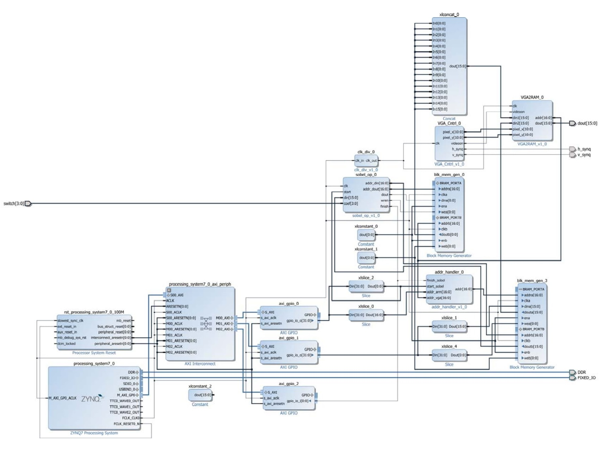

First Experience with Xilinx ZYNQ and Vivado Design Suite
============

A short video (AVI FORMAT) is read by PS on MMC and sent to PL, then a Sobel filter is applied to it and then displayed through the VGA port on the Monitor.

